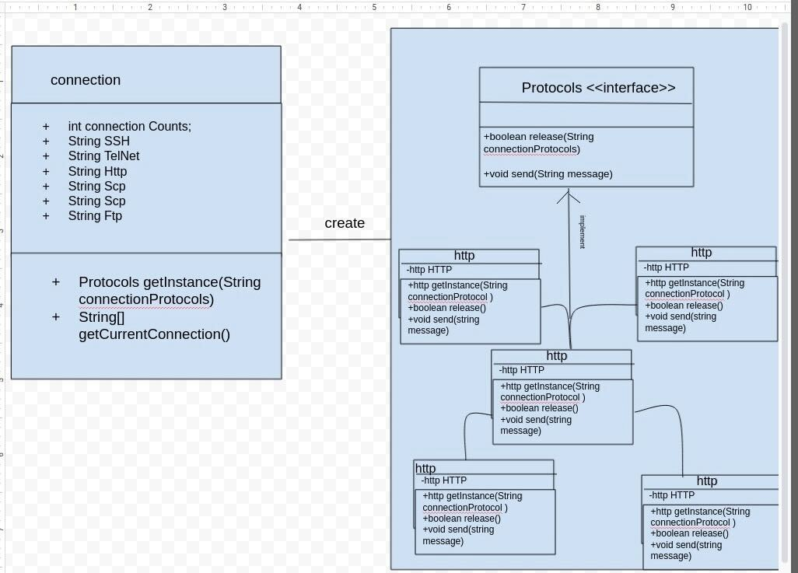

<h1> SOLID principle</h1>
<h3>1-single responsibilities , by making each class and it's own methods specialize in one functionallity</h3>
<h3>2-Interface Segregation Principle , by making a interface for all teh protoclos to force them to implement the two main function that's is shared between them </h3>
